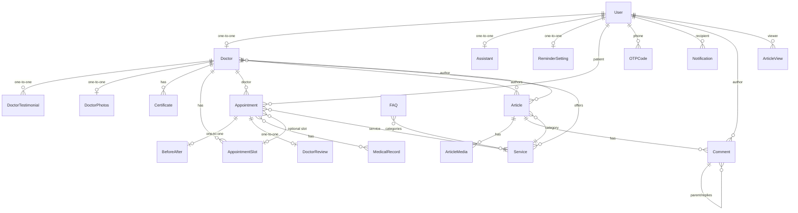

# Dentura — Dental Clinic Management System

**Production-oriented dental clinic platform with server-rendered pages, JWT authentication, appointment booking, doctor dashboards, and a full REST API.**

Dentura solves the problem of managing a dental clinic's digital presence: patients can discover doctors, book appointments via a slot-based system with OTP authentication, and track their treatment history. Doctors manage their profiles, prescriptions, articles, and patient reviews through a dedicated dashboard. The platform is built for the Iranian market with Persian (Farsi) language support throughout.

**Current Status:** Development / Production-ready for small-to-medium traffic ([Benchmark Report](ENGINEERING_REPORT.md))

---

## Table of Contents

- [Product Highlights](#product-highlights)
- [Engineering Highlights](#engineering-highlights)
- [Tech Stack](#tech-stack)
- [Architecture](#architecture)
- [Project Structure](#project-structure)
- [Main User Flows](#main-user-flows)
- [Database Architecture](#database-architecture)
- [Authentication & Security](#authentication--security)
- [API Documentation](#api-documentation)
- [SSR & Rendering Architecture](#ssr--rendering-architecture)
- [SEO](#seo)
- [Performance](#performance)
- [Testing](#testing)
- [Benchmark & Load Testing](#benchmark--load-testing)
- [Caching](#caching)
- [Background Tasks](#background-tasks)
- [Docker & Infrastructure](#docker--infrastructure)
- [Environment Variables](#environment-variables)
- [Local Development](#local-development)
- [Production Deployment](#production-deployment)
- [Security Considerations](#security-considerations)
- [License](#license)

---

## Product Highlights

### Authentication

- Phone-based authentication (Iranian mobile numbers: `09XXXXXXXXX`)
- OTP verification via SMS (Celery background task)
- OTP hashing (Django `make_password` / `check_password`)
- 10-minute OTP expiration
- 2-minute cooldown between OTP resends
- Maximum 5 OTP verification attempts
- JWT tokens stored as httpOnly cookies
- Auto-registration flow for new users

### Doctors

- Doctor profiles (speciality, university, experience, bio, medical license)
- Auto-generated slug-based URLs (`/doctors/<slug>/`)
- Profile and blog photos (compressed to WEBP on upload)
- Services offered (many-to-many)
- Working days
- Certificates
- Testimonial video
- Average rating (computed from approved reviews)
- Review count
- First available appointment slot (computed via DB subquery)
- Server-side sorting: by rating, availability, or experience
- Service-based filtering

### Appointments

- Slot-based booking system (`AppointmentSlot` model)
- Configurable slot duration (default 30 minutes)
- 8-minute reservation hold (PENDING status with expiry timer)
- Automatic release of expired reservations
- Tracking codes (`DNT-XXXXXXXX`)
- Appointment statuses: PENDING → RESERVED → DONE / CANCELLED
- Prescription text and file upload
- Medical records (many-to-many)
- Additional patient notes
- Doctor availability calendar (API-driven, configurable day range)

### Reviews

- Multi-axis ratings: professionalism, treatment quality, communication (1–5 each)
- Computed average rating
- Moderation workflow: PENDING → APPROVED / REJECTED
- Doctor auto-approval for own article comments
- Review cache invalidation on new submissions

### Blog & Content

- Articles authored by doctors
- Block-based content system (JSONField): headings, paragraphs, tips, warnings, info boxes, lists, quotes, tables, images, galleries
- Article media: images (compressed to WEBP) and videos (external URL or file upload)
- Video processing via Celery (FFmpeg pipeline — not configured yet)
- Article view tracking (per-user and per-IP deduplication)
- Featured / special articles
- Reading time estimation
- Category-based organization (linked to services)

### Comments

- Threaded comments (parent/child)
- Guest commenting (first name + last name) or authenticated commenting
- Moderation workflow: PENDING → APPROVED / REJECTED
- Doctor reply auto-approves parent comment
- Rate limiting: 10/hour anonymous, 30/hour authenticated

### Notifications

- Event-driven notifications via Django signals
- Types: Appointment, Gallery, Prescription, Checkup Reminder, Invoice, General
- Mark single notification as read
- Mark all as read
- Reminder settings (SMS reminder, checkup reminder)
- Persian-friendly relative time display

### Before/After Gallery

- Before and after images per appointment
- Service-based filtering
- Doctor-linked gallery items

### Assistant Profiles

- Assistants with speciality and blog photo
- Displayed on homepage

---

## Engineering Highlights

- **Custom User Model** — Phone-based (`USERNAME_FIELD = "phone"`), no password, national code identification
- **Hybrid SSR** — Server-rendered public pages with deterministic Redis caching + API-driven dashboards
- **JWT Cookie Authentication** — httpOnly, Secure, SameSite=Lax cookies for both SSR pages and API
- **Custom JWT Middleware** — `JWTAuthenticationMiddleware` bridges JWT auth with Django template views
- **OTP Hashing** — OTPs stored hashed using Django's `make_password` / `check_password`
- **Redis Caching** — Deterministic page cache with precise invalidation helpers
- **Cache Invalidation** — Signal-driven cache invalidation for doctors, articles, reviews, blog listings
- **Celery Background Tasks** — OTP sending, video processing, appointment lifecycle management
- **Image Processing** — PIL-based compression, resize, and WEBP conversion on upload
- **Structured Content** — JSONField-based block content system for articles
- **SEO Infrastructure** — robots.txt, sitemap.xml, JSON-LD structured data (FAQPage, BlogPosting, Physician)
- **Rate Limiting** — DRF throttling (login, OTP, resend, appointments, comments)
- **Security Headers** — Nginx-level: X-Content-Type-Options, X-Frame-Options, X-XSS-Protection, Referrer-Policy, Permissions-Policy
- **API Documentation** — drf-spectacular (Swagger UI + ReDoc)
- **Load Testing** — Locust framework with realistic user scenarios
- **Docker Orchestration** — 6-container setup with Nginx, Gunicorn, Redis, Celery Worker, Celery Beat, Locust
- **Gzip Compression** — Nginx-level response compression

---

## Tech Stack

| Layer            | Technology                        | Purpose                                      |
| ---------------- | --------------------------------- | -------------------------------------------- |
| Language         | Python 3.13                       | Core runtime                                 |
| Backend          | Django 6.0.7                      | Web framework                                |
| API              | Django REST Framework             | RESTful API layer                            |
| Authentication   | SimpleJWT + Custom OTP            | JWT cookies + phone-based OTP                |
| API Schema       | drf-spectacular                   | OpenAPI / Swagger / ReDoc                    |
| Frontend         | Django Templates + JavaScript     | Server-rendered pages with JS interactivity  |
| Database         | SQLite3 (development)             | Data storage (PostgreSQL recommended for prod) |
| Cache            | Redis 7-alpine                    | Page cache + API cache + Celery broker       |
| Background Tasks | Celery (Redis broker)             | OTP sending, video processing, schedulers    |
| Web Server       | Gunicorn (4 workers)              | WSGI application server                      |
| Reverse Proxy    | Nginx (alpine)                    | Static/media serving, compression, security  |
| Image Processing | Pillow (PIL) + python-magic       | Image compression, WEBP conversion, validation |
| Load Testing     | Locust                            | Stress testing and benchmarking              |
| Infrastructure   | Docker + docker-compose           | Containerized deployment                     |
| Testing          | Django TestCase + Locust          | Unit tests, integration tests, load tests    |

---

## Architecture

```text
                    ┌──────────────────────────────────────────────┐
                    │                   Clients                    │
                    │          (Browser / Mobile Browser)          │
                    └─────────────────────┬────────────────────────┘
                                          │
                                          ▼
                    ┌──────────────────────────────────────────────┐
                    │                 Nginx (80)                   │
                    │   ┌─────────────────────────────────────┐   │
                    │   │ Static files    → /static/ (30d)    │   │
                    │   │ Media files     → /media/ (7d)      │   │
                    │   │ robots.txt      → no-cache          │   │
                    │   │ sitemap.xml     → 1h cache          │   │
                    │   │ Everything else → proxy to Gunicorn  │   │
                    │   └─────────────────────────────────────┘   │
                    │   Security headers │ Gzip compression       │
                    └─────────────────────┬────────────────────────┘
                                          │
                                          ▼
              ┌───────────────────────────────────────────────────────┐
              │              Gunicorn (4 workers, port 8000)         │
              │              ┌─────────────────────────┐              │
              │              │    Django Application    │              │
              │              ├─────────────────────────┤              │
              │              │ SSR Views (Templates)    │              │
              │              │   /  /doctors/  /blog/   │              │
              │              ├─────────────────────────┤              │
              │              │ REST API (DRF)           │              │
              │              │   /api/doctors/          │              │
              │              │   /api/appointments/     │              │
              │              │   /api/doctor-dashboard/ │              │
              │              ├─────────────────────────┤              │
              │              │ JWT Middleware            │              │
              │              │ Session Auth             │              │
              │              │ DRF Throttling           │              │
              │              └──────┬───────┬───────────┘              │
              └─────────────────────┼───────┼──────────────────────────┘
                                    │       │
                    ┌───────────────┘       └──────────────┐
                    ▼                                      ▼
        ┌──────────────────┐                ┌──────────────────────┐
        │    Redis (7)      │                │     SQLite3          │
        │  DB 0: Celery     │                │   (or PostgreSQL*)   │
        │  DB 1: Cache      │                │                     │
        └────────┬─────────┘                └──────────────────────┘
                 │
        ┌────────┴─────────┐
        │                   │
        ▼                   ▼
┌──────────────┐   ┌─────────────────┐
│ Celery Worker │   │  Celery Beat    │
│ (async tasks) │   │ (periodic tasks)│
│               │   │                 │
│ • OTP sending │   │ • mark_done     │
│ • video proc  │   │ • release_exp   │
└──────────────┘   └─────────────────┘
```

---

## Project Structure

```text
project/
├── backend/
│   ├── apps/
│   │   ├── accounts/          # Custom User model, OTP, authentication views
│   │   │   ├── models.py      # User, OTPCode models
│   │   │   ├── views.py       # Login, OTP, logout views
│   │   │   ├── tasks.py       # Celery OTP sending task
│   │   │   └── services/      # OTP generation, hashing, verification
│   │   ├── doctors/           # Doctor profiles, assistants
│   │   │   ├── models.py      # Doctor, DoctorTestimonial, DoctorPhotos, Certificate, Assistant
│   │   │   ├── views.py       # SSR team page, doctor detail, dashboard pages
│   │   │   └── signals.py     # Cache invalidation on doctor profile changes
│   │   ├── appointments/      # Services, slots, appointments, reviews
│   │   │   ├── models.py      # Service, AppointmentSlot, Appointment, DoctorReview, MedicalRecord
│   │   │   ├── services.py    # Business logic (release expired, mark completed)
│   │   │   └── tasks.py       # Celery periodic tasks
│   │   ├── blog/              # Articles, comments, FAQs, before/after
│   │   │   ├── models.py      # Article, ArticleMedia, ArticleView, Comment, FAQ, BeforeAfter
│   │   │   ├── views.py       # SSR blog pages (index, articles, detail, before/after)
│   │   │   ├── signals.py     # Auto-approve doctor comments, cache invalidation
│   │   │   ├── tasks.py       # Celery video processing task
│   │   │   └── templatetags/  # content_blocks, to_jalali, to_persian_num filters
│   │   ├── notifications/     # Notifications and reminder settings
│   │   │   ├── models.py      # Notification, ReminderSetting
│   │   │   └── signals.py     # Event-driven notification creation
│   │   └── core/              # Homepage, sitemaps, robots.txt
│   │       ├── views.py       # Homepage SSR view
│   │       └── sitemaps.py    # StaticViewSitemap, ArticleSitemap, DoctorSitemap
│   ├── api/                   # Django REST Framework API layer
│   │   ├── doctors/           # GET /api/doctors/ (list with annotations)
│   │   ├── doctor_availability/ # GET /api/doctors/<slug>/availability/
│   │   ├── appointments/      # POST /api/appointments/, GET/PATCH detail
│   │   ├── doctor_dashboard/  # Overview, appointments, articles, comments, reviews, profile
│   │   ├── doctor_reviews/    # GET /api/doctor-reviews/, POST create
│   │   ├── articles/          # GET/POST /api/articles/<slug>/comments/
│   │   ├── dashboard/         # GET /api/dashboard/me/
│   │   ├── gallery/           # GET /api/gallery/
│   │   ├── services/          # GET /api/services/
│   │   ├── notifications/     # GET/PATCH /api/notifications/
│   │   └── before_after/      # Serializer for before/after data
│   ├── security/              # Cross-cutting security concerns
│   │   ├── jwt_middleware.py   # JWTAuthenticationMiddleware (cookie → request.user)
│   │   ├── jwt_views.py       # Cookie token obtain/refresh/verify/logout
│   │   ├── throttle.py        # Login, OTP, Resend, Appointment, Comment throttles
│   │   ├── cache.py           # Cache TTLs, key builders, invalidation helpers
│   │   └── process_images.py  # PIL compression, resize, WEBP conversion
│   ├── config/                # Django project configuration
│   │   ├── settings/
│   │   │   ├── base.py        # Core settings (DRF, JWT, Celery, Redis, cache)
│   │   │   ├── development.py # Dev settings (drf-spectacular)
│   │   │   └── production.py  # Prod settings (drf-spectacular)
│   │   ├── urls.py            # Root URL configuration
│   │   ├── celery.py          # Celery app configuration
│   │   ├── wsgi.py
│   │   └── asgi.py
│   ├── templates/             # Django HTML templates
│   │   ├── home/              # Homepage
│   │   ├── blog/              # Blog, articles, doctor profile, team, before/after
│   │   ├── auth/              # Login, OTP verification, registration info
│   │   ├── dashboard/         # Patient dashboard, appointments, gallery, notifications
│   │   ├── doctor_dashboard/  # Doctor analytics, appointments, articles, comments, reviews, profile
│   │   └── robots.txt         # robots.txt template
│   ├── static/                # Static assets (CSS, JS, images, fonts)
│   │   ├── css/
│   │   ├── js/
│   │   ├── fonts/
│   │   └── images/
│   ├── media/                 # User-uploaded media (gitignored)
│   ├── nginx/nginx.conf       # Nginx reverse proxy configuration
│   ├── requirements/
│   │   ├── base.txt           # Production dependencies
│   │   └── develope.txt       # Development + testing dependencies
│   ├── Dockerfile             # Python 3.13, system deps, pip install
│   ├── docker-compose.yml     # 6 services: nginx, backend, redis, celery_worker, celery_beat, locust
│   ├── entrypoint.sh          # migrate → collectstatic → exec CMD
│   ├── locustfile.py          # Load test scenarios (public pages, OTP flow, mixed)
│   └── manage.py
├── CLIENT_REPORT.md           # Client-facing performance report
├── ENGINEERING_REPORT.md      # Detailed engineering benchmark report
└── README.md
```

### App Responsibilities

| App/Module      | Responsibility                                                      |
| --------------- | ------------------------------------------------------------------- |
| `accounts`      | Custom User model (phone-based), OTP generation/verification, auth  |
| `doctors`       | Doctor profiles, assistants, certificates, SSR views                |
| `appointments`  | Services, booking slots, appointments, reviews, medical records     |
| `blog`          | Articles, media, comments, FAQs, before/after gallery               |
| `notifications` | In-app notifications, reminder settings, signal-driven creation     |
| `core`          | Homepage, sitemaps, robots.txt                                      |
| `api`           | RESTful API layer (DRF ViewSets and APIViews)                       |
| `security`      | JWT middleware, throttle classes, cache helpers, image processing    |

---

## Main User Flows

### Patient — Book an Appointment

```text
Homepage (/)
   │
   ▼
Browse Doctors (/doctors/)
   │
   ▼
Doctor Profile (/doctors/<slug>/)
   │
   ▼
Select Service → Select Doctor (/dashboard/select-doctors/<service>/)
   │
   ▼
View Availability Calendar (GET /api/doctors/<slug>/availability/)
   │
   ▼
Select Slot → POST /api/appointments/  (requires login)
   │
   ├─ [Not logged in] → Login → OTP Verification → Register (if new user)
   │
   ▼
Finalize Information (/dashboard/finalize_information/<tracking_code>/)
   │  PATCH /api/appointments/<tracking_code>/  (confirm reservation)
   │  - Medical records
   │  - Additional notes
   │  - Self or other booking
   │
   ▼
Confirmation → Dashboard (/dashboard/)
   │
   ▼
Notifications → Appointment Status Updates
```

### Doctor — Manage Practice

```text
Login → Doctor Dashboard (/doctors/dashboard/)
   │
   ├── Overview     → KPIs (patients, appointments, rating, articles)
   ├── Appointments → List, filter by status, write prescriptions
   ├── Articles     → Create/edit articles with block content editor
   │                    Upload images (auto-compressed) and videos
   ├── Comments     → View and reply to patient comments
   ├── Reviews      → View patient reviews with rating breakdown
   └── Profile      → Edit profile, photos, services, certificates
```

### Authentication Flow

```text
Login Page (/accounts/login/)
   │  POST phone_number
   │  Throttle: 10/hour per IP
   │
   ▼
OTP Sent via Celery (background)
   │
   ▼
OTP Page (/accounts/otp/)
   │  Enter 5-digit code
   │  Throttle: 5/hour per phone/IP
   │  Max 5 attempts per OTP
   │
   ├─ [Existing user] → login() → JWT cookies set → Redirect to dashboard
   │
   └─ [New user] → OTP verified → Registration page (/accounts/login-info/)
                    Create user → login() → JWT cookies set → Redirect to dashboard
```

---

## Database Architecture

### Entity Relationship Diagram



### Main Models

| Model            | Key Fields                                                            | Relationships                         |
| ---------------- | --------------------------------------------------------------------- | ------------------------------------- |
| `User`           | phone (unique), national_code (unique), full_name                    | OneToOne: Doctor, Assistant           |
| `OTPCode`        | phone_number, code (hashed), attempts, is_used, expires_at            | —                                     |
| `Doctor`         | slug (unique), speciality, university, years_of_experience, bio       | OneToOne: User, Photos, Testimonial   |
| `Service`        | name, slug (unique), description, icon, badge                        | M2M: Doctor, Article                  |
| `AppointmentSlot`| doctor, start_time, duration_minutes, is_active                       | FK: Doctor                            |
| `Appointment`    | tracking_code (unique), status, appointment_date, price, expires_at   | FK: Doctor, Patient(User), Service, Slot |
| `DoctorReview`   | professionalism/treatment/communication_rating, rating (computed)     | FK: Appointment                       |
| `Article`        | slug (unique), title, content, content_blocks (JSON), is_published    | FK: Doctor(author), Service(category) |
| `ArticleMedia`   | media_type, file, processed_file, video_url, processing_status        | FK: Article                           |
| `Comment`        | content, status, parent (self-referential), guest names               | FK: User, Article, parent             |
| `BeforeAfter`    | before_image, after_image, description                                | OneToOne: Appointment                 |
| `Notification`   | title, message, notification_type, is_read, link                      | FK: User(recipient)                   |

### Database Indexes

| Index                        | Model            | Fields                      | Purpose                        |
| ---------------------------- | ---------------- | --------------------------- | ------------------------------ |
| `doctor_start_time`          | AppointmentSlot  | (doctor, start_time)        | Availability queries           |

*Additional indexes recommended: `Doctor.slug`, `Article.slug`, `DoctorReview(appointment, status)`, `Comment(article, status)` — see [Benchmark Report](ENGINEERING_REPORT.md#bottleneck-analysis).*

---

## Authentication & Security

### User Model

- **Custom User Model** extending `AbstractBaseUser` + `PermissionsMixin`
- **Primary identifier:** Phone number (`USERNAME_FIELD = "phone"`)
- **No password:** `set_unusable_password()` — all authentication is OTP-based
- **Required fields:** phone, national_code, first_name, last_name
- **Auto-computed field:** `full_name` (concatenation on save)

### OTP Flow

1. User submits phone number → OTP code generated (5 digits, `secrets.randbelow`)
2. OTP hashed via `make_password()` before database storage
3. OTP sent via Celery background task (`send_otp_task.delay()`)
4. User enters code → verified against hash via `check_password()`
5. OTP expires after 10 minutes
6. Maximum 5 verification attempts per OTP
7. 2-minute cooldown between OTP resends

### JWT Authentication

- **Access token lifetime:** 30 minutes (configurable)
- **Refresh token lifetime:** 7 days (configurable)
- **Storage:** httpOnly, Secure (in production), SameSite=Lax cookies
- **Rotation:** Refresh token rotation enabled, old tokens blacklisted
- **Middleware:** `JWTAuthenticationMiddleware` — authenticates template views via JWT cookie when session auth is absent

### Security Measures

| Measure                       | Implementation                                       |
| ----------------------------- | ---------------------------------------------------- |
| CSRF protection               | Django CSRF middleware                                |
| Rate limiting (login)         | 10/hour per IP                                       |
| Rate limiting (OTP verify)    | 5/hour per phone/IP                                  |
| Rate limiting (OTP resend)    | 3/hour per phone/IP                                  |
| Rate limiting (appointments)  | 15/hour                                              |
| Rate limiting (comments)      | 10/hour anonymous, 30/hour authenticated             |
| Security headers              | Nginx: X-Content-Type-Options, X-Frame-Options, X-XSS-Protection, Referrer-Policy, Permissions-Policy |
| Secure cookies                | httpOnly + Secure (production) + SameSite=Lax        |
| OTP hashing                   | Django password hashers (PBKDF2)                     |
| Secret management             | django-environ via `.env` file                        |
| Proxy SSL header              | `SECURE_PROXY_SSL_HEADER` for Nginx                  |
| Clickjacking protection       | `XFrameOptionsMiddleware`                            |
| XSS protection                | Nginx `X-XSS-Protection: 1; mode=block`             |

### Environment Variables

| Variable                             | Purpose                                    | Default                          |
| ------------------------------------ | ------------------------------------------ | -------------------------------- |
| `SECRET_KEY`                         | Django secret key                          | — (required)                     |
| `DEBUG`                              | Debug mode                                 | `False`                          |
| `ALLOWED_HOSTS`                      | Comma-separated allowed hosts              | — (required)                     |
| `DB_NAME`                            | SQLite database filename                   | `db.sqlite3`                     |
| `CELERY_BROKER_URL`                  | Redis URL for Celery broker                | `redis://localhost:6379/0`       |
| `CELERY_RESULT_BACKEND`              | Redis URL for Celery results               | `redis://localhost:6379/0`       |
| `REDIS_CACHE_URL`                    | Redis URL for Django cache                 | `redis://localhost:6379/1`       |
| `TRUSTED_ORIGINS`                    | CORS / CSRF trusted origins                | `http://localhost,http://127.0.0.1` |
| `SIMPLE_JWT_ACCESS_LIFETIME_MINUTES` | JWT access token lifetime                  | `30`                             |
| `SIMPLE_JWT_REFRESH_LIFETIME_DAYS`   | JWT refresh token lifetime                 | `7`                              |
| `SIMPLE_JWT_SECRET_KEY`              | JWT signing key                            | Same as SECRET_KEY               |

---

## API Documentation

### Public Endpoints

| Method | Endpoint                                 | Description                              | Auth        |
| ------ | ---------------------------------------- | ---------------------------------------- | ----------- |
| GET    | `/api/doctors/`                          | List doctors (paginated, annotated)      | No          |
| GET    | `/api/doctors/<slug>/availability/`      | Doctor availability slots (1–60 days)    | No          |
| GET    | `/api/doctor-reviews/`                   | List approved reviews (cached)           | No          |
| GET    | `/api/services/`                         | List all services (cached)               | No          |
| GET    | `/api/articles/<slug>/comments/`         | List approved comments for article       | No          |
| POST   | `/api/articles/<slug>/comments/`         | Create comment (guest or authenticated)  | No          |

### Authenticated Endpoints — Patient

| Method | Endpoint                                 | Description                              | Auth        |
| ------ | ---------------------------------------- | ---------------------------------------- | ----------- |
| POST   | `/api/appointments/`                     | Create appointment (book a slot)         | JWT/Session |
| GET    | `/api/appointments/<tracking_code>/`     | Get appointment detail                   | JWT/Session |
| PATCH  | `/api/appointments/<tracking_code>/`     | Confirm reservation (finalize info)      | JWT/Session |
| GET    | `/api/dashboard/me/`                     | User dashboard data                      | JWT/Session |
| GET    | `/api/gallery/`                          | Patient's before/after gallery           | JWT/Session |
| GET    | `/api/notifications/`                    | List notifications (?unread=true)        | JWT/Session |
| PATCH  | `/api/notifications/<id>/read/`          | Mark notification as read                | JWT/Session |
| POST   | `/api/notifications/mark-all-read/`      | Mark all as read                         | JWT/Session |
| GET/PATCH | `/api/reminders/settings/`             | Get/update reminder settings             | JWT/Session |
| POST   | `/api/doctor-reviews/create/`            | Create a doctor review                   | JWT/Session |

### Authenticated Endpoints — Doctor Dashboard

| Method | Endpoint                                           | Description                        | Auth        |
| ------ | -------------------------------------------------- | ---------------------------------- | ----------- |
| GET    | `/api/doctor-dashboard/overview/`                  | Dashboard KPIs and analytics       | JWT + Doctor |
| GET    | `/api/doctor-dashboard/appointments/`              | List doctor's appointments         | JWT + Doctor |
| PATCH  | `/api/doctor-dashboard/appointments/<pk>/prescription/` | Update prescription text     | JWT + Doctor |
| GET/POST | `/api/doctor-dashboard/articles/`                | List/create articles               | JWT + Doctor |
| GET/PUT/DELETE | `/api/doctor-dashboard/articles/<pk>/`       | Get/update/delete article          | JWT + Doctor |
| POST   | `/api/doctor-dashboard/articles/<id>/media/`       | Upload article media               | JWT + Doctor |
| DELETE | `/api/doctor-dashboard/articles/<id>/media/<id>/`  | Delete article media               | JWT + Doctor |
| GET    | `/api/doctor-dashboard/comments/`                 | List comments on doctor's articles | JWT + Doctor |
| POST   | `/api/doctor-dashboard/comments/<pk>/reply/`       | Reply to a comment                 | JWT + Doctor |
| GET    | `/api/doctor-dashboard/reviews/`                  | List reviews with summary stats    | JWT + Doctor |
| GET/PUT | `/api/doctor-dashboard/profile/`                  | Get/update doctor profile          | JWT + Doctor |

### JWT Authentication Endpoints

| Method | Endpoint                  | Description                              | Auth  |
| ------ | ------------------------- | ---------------------------------------- | ----- |
| POST   | `/api/token/`             | Issue JWT tokens (after OTP verify)      | No    |
| POST   | `/api/token/refresh/`     | Refresh access token                     | No    |
| GET    | `/api/token/verify/`      | Verify access token validity             | No    |
| POST   | `/api/token/logout/`      | Clear JWT cookies + blacklist refresh    | No    |

### API Schema

- Swagger UI: `/api/schema/swagger-ui/`
- ReDoc: `/api/schema/redoc/`
- OpenAPI schema: `/api/schema/`

---

## SSR & Rendering Architecture

Dentura uses a **hybrid SSR architecture**: public pages are server-rendered with Django templates and cached in Redis, while dashboards are API-driven JavaScript SPAs.

### Rendering Strategy

| Page                    | Rendering | Cache TTL | SEO Critical | Content in HTML |
| ----------------------- | --------- | --------- | ------------ | --------------- |
| Homepage (`/`)          | SSR       | 15 min    | Yes          | Doctors, assistants, reviews, videos, before/after |
| Team (`/doctors/`)      | SSR       | 2 min     | Yes          | Doctor cards, service filters |
| Doctor Detail (`/doctors/<slug>/`) | SSR | 5 min | Yes | Profile, reviews, certificates, articles, before/after |
| Blog Index (`/blog/`)   | SSR       | 15 min    | Yes          | FAQs, services |
| Articles (`/blog/articles/`) | SSR  | 10 min    | Yes          | Article cards, featured, popular, filters |
| Article Detail (`/blog/article/<slug>/`) | SSR | 10 min | Yes | Full article, TOC, comments, reviews, JSON-LD |
| Before/After (`/blog/before_after/`) | SSR | 15 min | Yes | Gallery items, filters, JSON data island |
| Patient Dashboard       | Template + JS API | —  | No           | API-driven       |
| Doctor Dashboard        | Template + JS API | —  | No           | API-driven       |
| Login / OTP             | Template  | —         | No           | Form-based       |

### SSR Implementation

The `render_cached_page()` helper (in `security/cache.py`) provides deterministic page caching:
1. Check Redis for a cached HTML string under a deterministic key
2. On cache miss: execute the `context_builder`, render the template, store the HTML in Redis
3. On cache hit: return the cached `HttpResponse` directly (no ORM queries)

Cache invalidation is signal-driven — when underlying data changes (new review, article edit, doctor profile update), the corresponding cache keys are deleted via helpers in `cache.py`.

All SSR pages include `data-ssr="1"` markers for monitoring and contain meaningful content in the initial HTML response for SEO.

---

## SEO

### Implemented

| Feature                    | Status     | Details                                          |
| -------------------------- | ---------- | ------------------------------------------------ |
| `robots.txt`               | ✅          | Template-rendered, disallows /admin/, /dashboard/, /api/ |
| `sitemap.xml`              | ✅          | Static pages + articles + doctors (Django sitemaps framework) |
| JSON-LD structured data    | ✅          | `FAQPage`, `BlogPosting`, `Physician` schemas     |
| Title tags                 | ✅          | Set in templates for all public pages             |
| Semantic HTML              | ✅          | `<article>`, `<section>`, heading hierarchy       |
| SSR content in initial HTML | ✅         | All public pages render meaningful content server-side |
| Canonical URLs             | Not implemented | —                                            |
| Open Graph / Twitter metadata | Partial  | `og:image` set for articles                       |
| Meta descriptions          | Not implemented | —                                            |
| `data-ssr` markers         | ✅          | Added to all SSR pages for monitoring             |
| Jalali date rendering      | ✅          | Custom `to_jalali` template filter                |
| Persian numeral rendering  | ✅          | Custom `to_persian_num` template filter           |

### Sitemap Structure

| URL Pattern                    | Priority | Change Frequency |
| ------------------------------ | -------- | ---------------- |
| `/` (Homepage)                 | 1.0      | —               |
| `/doctors/` (Team)             | 0.8      | —               |
| `/blog/` (Blog Index)          | 0.8      | —               |
| `/blog/articles/`              | 0.7      | —               |
| `/blog/article/<slug>/`        | 0.6      | Weekly           |
| `/doctors/<slug>/`             | 0.7      | Monthly          |

### SEO Benchmark

SEO benchmark: Not measured yet.

---

## Performance

### Response Times (from [Benchmark Report](ENGINEERING_REPORT.md))

| Phase           | Concurrent Users | Avg (ms) | Median (ms) | P95 (ms) | P99 (ms) | RPS    | Error Rate |
| --------------- | ---------------- | -------- | ----------- | -------- | -------- | ------ | ---------- |
| Baseline        | 1                | 24       | 6           | 140      | 310      | 0.50   | 0.00%      |
| Low Load        | 10               | 9        | 6           | 45       | 60       | 4.44   | 1.13%      |
| Medium Load     | 50               | 10       | 6           | 44       | 55       | 21.68  | 0.98%      |
| High Load       | 100              | 12       | 7           | 48       | 66       | 43.81  | 1.35%      |
| Extreme Load    | 250              | 18       | 8           | 55       | 120      | 109.43 | 1.22%      |

> **Note:** All errors (1.2–1.3%) are intentional login rate-limiting (429 responses) — no system errors or crashes.

### Performance Optimizations Implemented

| Optimization               | Where                              |
| -------------------------- | ---------------------------------- |
| `select_related`           | Doctor list, detail, reviews, appointments |
| `prefetch_related`         | Services, photos, media, comments  |
| ORM annotations            | Average rating, review count, availability subquery |
| Database indexes           | `AppointmentSlot(doctor, start_time)`, `Service(slug)` |
| Redis page cache           | All public SSR pages (2–15 min TTLs) |
| Redis API cache            | Doctor list (2 min), reviews (5 min), articles (10 min) |
| Deterministic page cache   | Custom `render_cached_page()` with signal-driven invalidation |
| Nginx static file caching  | `/static/` (30d), `/media/` (7d)   |
| Gzip compression           | Nginx-level for all text/JSON/JS/CSS responses |
| Image optimization         | PIL compression + WEBP conversion on upload |
| Background OTP sending     | Celery task returns HTTP response immediately |
| `only()` query optimization | Doctor list selects only needed fields |

### Benchmark Environment

- **Server:** Docker containers (`runserver` — not Gunicorn, see limitations below)
- **Database:** SQLite3
- **Network:** Docker internal network (no real-world latency)
- **Load tool:** Locust 2.46.4

> ⚠️ The benchmark was run using `manage.py runserver` (single-threaded dev server) rather than Gunicorn. Production Gunicorn with 4 workers will provide significantly better concurrency. SQLite also limits write concurrency. See [Benchmark Report](ENGINEERING_REPORT.md#limitations) for details.

---

## Testing

### Running Tests

```bash
# Run all tests
python manage.py test

# Run tests for a specific app
python manage.py test backend.apps.accounts
python manage.py test backend.apps.appointments
python manage.py test backend.apps.blog
python manage.py test backend.apps.core
python manage.py test backend.apps.doctors
python manage.py test backend.apps.notifications
python manage.py test backend.api
```

### Test Coverage

| App            | Tests | Focus                                              |
| -------------- | ----- | -------------------------------------------------- |
| `accounts`     | ✅     | User creation, OTP validity, model fields          |
| `appointments` | ✅     | Service model, appointment lifecycle, tracking codes, reviews |
| `blog`         | ✅     | Article CRUD, media types, comments, FAQs, before/after, SSR pages |
| `core`         | ✅     | Homepage SSR rendering, cache behavior             |
| `doctors`      | ✅     | Doctor model, slug generation, services, certificates, assistant, SSR pages |
| `notifications`| ✅     | Notification types, time_since, ordering, Persian numerals |
| `api`          | ✅     | Permissions (IsDoctorUser), API endpoints (doctor list, services, dashboard, profile) |

### Test Infrastructure

- Tests use `LocMemCache` (in-memory) instead of Redis for cache-related tests
- `@override_settings(CACHES=TEST_CACHES)` decorator isolates cache behavior
- SSR tests verify `data-ssr="1"` markers, JSON-LD schemas, and content presence in raw HTML

---

## Benchmark & Load Testing

### Locust Configuration

The `locustfile.py` defines three user classes:

| User Class        | Weight | Behavior                                            |
| ----------------- | ------ | --------------------------------------------------- |
| `PublicPagesUser` | 8      | Anonymous browsing (home, doctors, blog, before/after) |
| `MixedUser`       | 4      | Realistic page browsing + OTP flow                  |
| `OtpFlowUser`     | 1      | Login → OTP verification flow                       |

### Running Load Tests

```bash
# Via Docker Compose (recommended)
docker compose up locust
# Open http://localhost:8089 to configure and run

# Or locally
locust -f backend/locustfile.py --host http://localhost
```

### Detailed Results

Full benchmark data is available in:
- [CLIENT_REPORT.md](CLIENT_REPORT.md) — Client-facing summary
- [ENGINEERING_REPORT.md](ENGINEERING_REPORT.md) — Detailed engineering report with all 7 test phases

### Key Findings

- **Optimal capacity:** 50 concurrent users
- **Maximum capacity:** 250 concurrent users (degraded but functional)
- **Peak throughput:** ~110 requests/second
- **All errors are intentional** — login rate-limiting (429 responses)

---

## Caching

### Cache Backend

- **Engine:** Redis (DB 1, separate from Celery on DB 0)
- **Default TTL:** 5 minutes
- **Key prefix:** `dentura`

### Page Cache (SSR)

| Page               | TTL     | Cache Key Example                    |
| ------------------ | ------- | ------------------------------------ |
| Homepage           | 15 min  | `dentura:pages:home`                 |
| Team               | 2 min   | `dentura:pages:team`                 |
| Doctor Detail      | 5 min   | `dentura:pages:doctor:<slug>`        |
| Blog Index         | 15 min  | `dentura:pages:blog_index`           |
| Articles Listing   | 10 min  | `dentura:pages:all_articles`         |
| Article Detail     | 10 min  | `dentura:pages:post_article:<slug>`  |
| Before/After       | 15 min  | `dentura:pages:before_after`         |

### API Cache

| Endpoint            | TTL   | Cache Key Example                        |
| ------------------- | ----- | ---------------------------------------- |
| Doctor List         | 2 min | `dentura:doctors:list:all:default`       |
| Doctor Reviews      | 5 min | `dentura:reviews:list`                   |
| Article Comments    | 1 min | `dentura:articles:comments:<slug>`       |
| Services            | 1 hr  | `dentura:services` (via `@cache_page`)   |

### Cache Invalidation

Invalidation is **signal-driven** and **explicit**:

| Trigger                        | Invalidates                                           |
| ------------------------------ | ----------------------------------------------------- |
| Doctor profile saved           | Doctor detail, team page, homepage                    |
| Review approved/rejected       | Reviews list, doctor list, doctor detail, homepage    |
| Article published/edited       | Article detail, comments, blog listing, homepage      |
| New comment on article         | Article detail, comments cache                        |
| Appointment created/confirmed  | Doctor list, doctor detail, availability              |

### Deterministic Page Cache

The `render_cached_page()` function stores rendered HTML under deterministic keys, enabling precise invalidation. On a cache hit, the ORM `context_builder` is never executed — the cached `HttpResponse` is returned directly.

---

## Background Tasks

### Celery Architecture

```text
                    ┌──────────────────────────────────────┐
                    │             Redis (DB 0)              │
                    │          (Message Broker)              │
                    └──────────┬──────────────┬─────────────┘
                               │              │
                               ▼              ▼
                    ┌──────────────────┐  ┌──────────────────┐
                    │  Celery Worker    │  │  Celery Beat      │
                    │  (async tasks)    │  │  (periodic)       │
                    └──────────────────┘  └──────────────────┘
```

### Task Types

| Task                                | Source App    | Trigger           | Retry Behavior              |
| ----------------------------------- | ------------- | ----------------- | --------------------------- |
| `send_otp_task`                     | accounts      | Login view        | max 3 retries, 10s delay    |
| `process_article_video`             | blog          | Media upload      | autoretry, backoff, max 3   |
| `mark_completed_appointments_task`  | appointments  | Celery Beat       | —                           |
| `release_expired_reservations_task` | appointments  | Celery Beat       | —                           |

### Scheduled Tasks (Celery Beat)

- Mark RESERVED appointments as DONE 30 minutes after appointment time
- Release PENDING reservations that exceeded the 8-minute TTL window

---

## Docker & Infrastructure

### Services

| Service          | Image / Build      | Port     | Purpose                          |
| ---------------- | ------------------ | -------- | -------------------------------- |
| `nginx`          | nginx:alpine       | 80       | Reverse proxy, static files, compression |
| `backend`        | Python 3.13 (Dockerfile) | 8000 | Django + Gunicorn (4 workers)    |
| `redis`          | redis:7-alpine     | 6379     | Cache + Celery broker            |
| `celery_worker`  | Python 3.13        | —        | Async task execution             |
| `celery_beat`    | Python 3.13        | —        | Periodic task scheduler          |
| `locust`         | Python 3.13        | 8089     | Load testing                     |

### Volumes

| Volume        | Containers          | Purpose                        |
| ------------- | ------------------- | ------------------------------ |
| `static_data` | nginx, backend, celery | Collected static files       |
| `./media`     | nginx, backend, celery | User uploads                 |
| `./db.sqlite3`| backend, celery       | Database file (shared)       |

### Entrypoint

```bash
python manage.py migrate --noinput
python manage.py collectstatic --noinput
exec "$@"  # Start the CMD (gunicorn by default)
```

---

## Local Development

### Prerequisites

- Python 3.13
- Redis server
- Docker & Docker Compose (optional, recommended)

### Setup with Docker (Recommended)

```bash
git clone <repository-url>
cd backend

# Create .env from example
cp .env.example .env
# Edit .env with your settings

# Start all services
docker compose up

# The application is available at http://localhost (Nginx)
# API docs at http://localhost/api/schema/swagger-ui/
# Locust at http://localhost:8089
```

### Manual Setup

```bash
git clone <repository-url>
cd backend

# Create virtual environment
python -m venv .venv
source .venv/bin/activate  # On Windows: .venv\Scripts\activate

# Install dependencies
pip install -r requirements/develope.txt

# Create .env from example
cp .env.example .env
# Edit .env with your settings

# Run migrations
python manage.py migrate

# Create superuser
python manage.py createsuperuser

# Collect static files
python manage.py collectstatic --noinput

# Start development server
python manage.py runserver

# In a separate terminal — start Celery worker
celery -A config worker --loglevel=info

# In a separate terminal — start Celery beat
celery -A config beat --loglevel=info
```

### Seed Data

```bash
python manage.py seed_data
```

### Running Tests

```bash
python manage.py test
```

---

## Production Deployment

### Configuration

The project includes production-ready configuration:

- **Gunicorn:** 4 workers, 120s timeout
- **Nginx:** Reverse proxy with security headers, gzip, static/media caching
- **Redis:** Separate databases for Celery (DB 0) and Django cache (DB 1)
- **Celery:** Worker + Beat for background and periodic tasks
- **Entrypoint:** Auto-runs migrations and collectstatic on startup

### Production Considerations

| Concern             | Current            | Recommendation                              |
| ------------------- | ------------------ | ------------------------------------------- |
| Database            | SQLite3            | Migrate to PostgreSQL for write concurrency |
| HTTPS               | Not configured     | Add SSL certificates (Let's Encrypt)        |
| Gunicorn            | Development server | Use Gunicorn for WSGI serving               |
| Static files        | Docker volume      | Use CDN or S3 for static assets             |
| Media files         | Local filesystem   | Use S3/object storage for media             |
| Monitoring          | Not implemented    | Add health checks, APM, logging aggregation |
| Error tracking      | Not implemented    | Add Sentry or similar                       |
| CI/CD               | Not configured     | Set up automated testing and deployment     |

---

## Security Considerations

### Implemented

- ✅ Phone-based OTP authentication (no passwords stored)
- ✅ OTP codes hashed before database storage
- ✅ JWT tokens in httpOnly cookies (not accessible via JavaScript)
- ✅ Secure cookies in production (HTTPS-only)
- ✅ SameSite=Lax cookie policy
- ✅ CSRF middleware enabled
- ✅ Rate limiting on all sensitive endpoints
- ✅ Login throttling (10/hour per IP)
- ✅ OTP throttling (5/hour per phone)
- ✅ Nginx security headers (X-Content-Type-Options, X-Frame-Options, etc.)
- ✅ `X-Frame-Options: DENY` (clickjacking protection)
- ✅ `Permissions-Policy` (camera, microphone, geolocation, etc. disabled)
- ✅ Environment-based secret management via `django-environ`
- ✅ No secrets in code (`.env` excluded from git)
- ✅ Image type validation (python-magic MIME checking)
- ✅ Image size limits (3 MB max)

### Not Implemented

- ❌ HTTPS/SSL termination
- ❌ CORS configuration
- ❌ Content Security Policy (CSP) headers
- ❌ Account lockout after failed attempts
- ❌ Audit logging
- ❌ Dependency vulnerability scanning
- ❌ Penetration testing

---

## License

License: Not specified.

---

## Author / Contact

No author information found in the repository.
